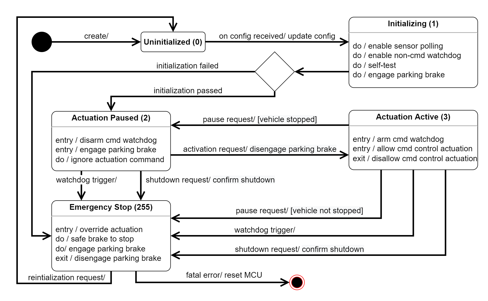

# State Machine Design

## Uninitialized (State Code 0)

When the MCU boots up, it enters uninitialized state. No actuation can happen in this state. No sensor reading will be sent to the PC, unless the MCU was previously initialized and is sent back from Emergency Stop state.

The MCU will listen to incoming handshake request from the PC and respond to establish communication. No state transition would happen before the handshake, unless the MCU was previously initialized.

### Valid transitions out of Uninitialized

- If **after handshake** the MCU receives a **configuration packet**, it will update its configuration parameters and transition to **Initializing** state.

## Initializing (State Code 1)

In this state the MCU performs initialization tasks. First it enables subsystems responsibe for polling individual sensors. Then it enables watchdogs to all subsystems, including sensor polling, actuation, communication, and main controller, except the watchdog on incoming control command, which is not required in this state.

After enabling essential watchdogs, the MCU will perform a self-test, including:

- moving steering and brake actuators and check if the resulting actuator positions are valid,
- checking if other sensor readings are valid, and
- checking if any watchdog triggers in the test.

After all test passes, the MCU will engage parking brake. The time it takes for the MCU to reach this step from entering Initializing state cannot exceed 60 second.

### Valid transitions out of Uninitialized

- If all of the aforementioned stages **pass**, the MCU will spontaneously transition to **Actuation Paused** state.
- If any of the aforementioned stages **fail**, if the 60 second limit is reached, or if the watchdog is triggered, the MCU will transition to **Emergency Stop** state.

## Actuation Paused (State Code 2)

This state is intended for the following scenarios:

- When the vehicle is initialized and ready to drive, or
- When in the middle of a run some high level autonomy stack needs to be restarted and may stop outputing control commands.

Entering this state, the MCU will disarm watchdog on incoming control command, and prevent any such command froming being actuated. Then parking brake will be engaged.

The MCU will continuing outputing heartbeat and sensor readings to the PC.

If any watchdog that is still active in this state is triggered, such as critical sensors, the MCU will still go to Emergency Stop state.

### Valid transitions out of Actuation Paused

- If an **activation request** is received, the MCU will **disengage parking brake** and go to **Actuation Active** state.
- If any active **watchdog** is triggered, the MCU will to go **Emergency Stop** state.
- If a **shutdown request** is received, the MCU will send back a **shutdown confirmation**, and go to **Emergency Stop** state.

## Actuation Active (State Code 3)

This is the active driving state of the vehicle.

Upon entering, the watchdog on control command will be armed, and actuators may move according to the command.

Upon exiting, the actutators will stop responding to any control command.

### Valid transitions out of Actuation Active

- If a **pause request** is received and the vehicle is **not moving**, the MCU will **engage parking brake** and go to **Actuation Paused** state.
- If a **paused request** is received while the vehicle is still **moving**, the MCU will go to **Emergency Stop** state.
- If any active **watchdog** is triggered, the MCU will to go **Emergency Stop** state.
- If a **shutdown request** is received, the MCU will send back a **shutdown confirmation**, and go to **Emergency Stop** state.

## Emergency Stop (State Code 255)

In this state, the goal of the MCU is to bring the vehicle to a safe stop ASAP. All control commands will be overriden.

Throttle output will stay at zero in this state.

Steering output will be latched to the last steering command, or neutral position if no such command is known.

Brake output will be as aggressive as posible as to not incurr wheel lock-up. If an Anti-Lock Braking System (ABS) exists on the MCU, it should be active. However, in the following scenarios, the brake output will be locked to maximum:

- When the wheel speed readings are deemed unreliable, or
- When fault in the brake system is detected.

Once the vehicle is stopped, the MCU will engage parking brake to prevent the vehicle from sliding.

### Valid transitions out of Emergency Stop

- If a **reinitialization** (or release-emergency-stop) request is received, the MCU will **disengage parking brake** (to allowing towing) and go to **Uninitialized** state.
- If **fatal error** is thrown, the MCU will **reset** itself.
