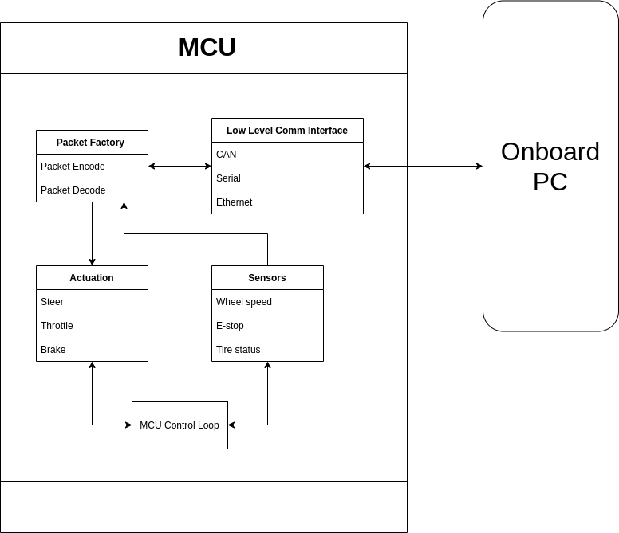

# Packet API

## Introduction

The transfer of messages through network interfaces of the team's choice (Serial, CAN, Ethernet) follows a standardized packet API for message serialization (encoding) and deserialization (decoding).

The low-level communication interface (LLCI) of Serial, CAN and Ethernet is agnostic about what is being transferred. On top of that, the high-level communication interface (HLCI), which is mainly the packet factory, is responsible for encoding and decoding between C++ class representation of message and low-level buffer to/from LLCI.

There are packet factories on both sides of the communication system, making it a reusable common library for both Go-Kart Controller (GKC) software and high-level softwares (ROS2).

## Packet Basics

Each packet is a variable buffer of bytes.

The Packet API takes substantial reference from VESC packet API.

A standard packet begins with byte 0x02, followed by 1 byte of payload length. Payload cannot exceed 256 bytes. After that, 2 bytes are used for payload checksum, and finally there is one termination byte 0x03.

The **first byte (FB)** of each payload type is uniquely identifiable.

Extended packet is not needed and not implemented at the moment, but any LLCI implementation should not rule out the possibility of such packet in the future.

To avoid garbage data, unused payload buffer section should be initiated to 0x00. 0x00 cannot have any substaintial meaning in the playload other than data.

## Core Payloads

These messages concerns the basic communication and device control, such as communication establishment, firmware version, MCU reset, heartbeat, and watchdog.

### Handshake \#1

Payload size: 5 Byte

FB: 0x04

The first handshake is initiated by the PC. The first byte of the payload is 0x04, followed by a 4-byte randomly generated unsigned integer as the sequence number.

### Handshake \#2

Payload size: 5 Byte

FB: 0x05

The second handshake given by the MCU after hearing handshake #1 from the PC. The first byte of the payload is 0x05, followed by a 4-byte unsigned integer which is the bit-wise complement of the number in handshake #1.

### Request Firmware Version

Payload size: 1 Byte

FB: 0x06

The PC requesting firmware version from the MCU.

### Respond Firmware Version

Payload size: 4 Byte

FB: 0x07

The MCU's response of firmware version in three `uint8`: version `x.y.z`

### Reset MCU

Payload size: 5 Byte

FB: 0xFF

The PC commanding a MCU reset. the four bytes of the message contains alternating 1s and 0s (decimal 2863311530 or hex AAAAAAAA).

### Heartbeat

Payload size: 3 Byte

FB: 0xAA

Bidirectional message with a `uint8` rolling counter that increments or overflows with every message sent to the other side, as well as a `uint8` state code of the MCU state machine state, which is only sent by MCU.

### Log

Payload size: variable

FB: 0xAD

String log with severity level of info, warning, error or fatal. The `c_str` content of the string cannot exceed 253 byte. The response to different severity levels is implementation-dependant.

## Configuration Payloads

These messages set the configurations of the controller.

### Configuation

Payload size: 49 Byte

FB: 0xA0

The PC sends configuations to the MCU, containing actuation calibrations and watchdog timeout intervals.

## Control Payloads

### Control

Payload size: 13 Byte

FB: 0xAB

The PC commands steering, throttle, and brake to the MCU.

### State Transition

Payload size: 2 Byte

FB: 0xA1

The PC requests a state transition on the MCU. Possible states include unintialized, initialized, active, paused, and emergency stop.

### Shutdown \#1

Payload size: 5 Byte

FB: 0xA2

The PC requests a shutdown to the MCU. The message contains a sequence number.

### Shutdown \#2

Payload size: 5 Byte

FB: 0xA3

The MCU responds to the shutdown command from the computer by adding one to the incoming sequence number in Shutdown #1.

## Feedback Payloads

### Sensors

These messages request or send GKC state, and sensor feedbacks.

Payload size: 48 Byte

FB: 0xAC

The MCU sends sensor data to the PC, containing wheel speeds, pressures, voltage, etc., and sensor fault flags.

## Reference

| Description              | Payload size | Payload FB | Data Structure                     | Sender |
|--------------------------|--------------|------------|------------------------------------|--------|
| Handshake #1             | 5            | 0x04       | uint32 sequence number.            | PC     |
| Handshake #2             | 5            | 0x05       | uint32 sequence number             | MCU    |
| Request Firmware Version | 1            | 0x06       |                                    | PC     |
| Respond Firmware Version | 4            | 0x07       | 3 * uint8 version number           | MCU    |
| Reset MCU                | 5            | 0xFF       | uint32 magic number                | PC     |
| Heartbeat                | 3            | 0xAA       | uint8 rolling counter and state    | Both   |
| Log                      | Variable     | 0xAD       | severity and string content        | Both   |
| Configuration            | 49           | 0xA0       | a packed struct of configurables   | PC     |
| Control                  | 13           | 0xAB       | throttle, steering, and brake      | PC     |
| State Transition         | 2            | 0xA1       | uint8 state number                 | PC     |
| Sensors                  | 22           | 0xAC       | a packed struct of sensor readings | MCU    |
| Shutdown \#1             | 5            | 0xA2       | uint32 sequence number.            | PC     |
| Shutdown \#2             | 5            | 0xA3       | uint32 sequence number.            | MCU    |
